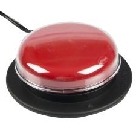
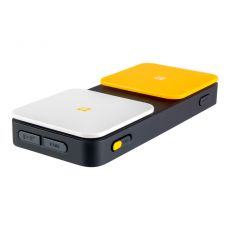

<html>
    <head>
    
    </head>
    <body>
    <h2><i>Devices are available for long-term checkout upon request.</i></h2>
     
    

      
      
The Jelly Bean switch features a 2.5-in activation surface and is recommended for users who are able to access a smaller target area.

    

    

       
       
Blue2 allows you to quickly and easily connect one or two accessibility switches to your device via a Bluetooth connection.

     

       

        
        
The Buddy Button is a durable and reliable single switch that requires only the slightest touch of its 2.5-in surface for activation.

      

     

        
        
The Jelly Beamer Twist Transmitter is a wireless switch that brings reliable, immediate switch access without the hassle of cords.

    
 
  

        
        
The Big Red switch provides a large 5-in activation surface that activates with 5.5-oz of force.

      

    

        
        
With a 1 3/8-in activation surface, the Specs switch is small enough to be worn, but is most often used as a mounted switch.

      

    

        
        
AbleNet Powerlink 4 Switch Control Unit grants users the control of two different electrical appliances with individual switches in their switch interface.

      

    

        
        
The Skoog is a customizable electronic musical instrument that has been designed to be inclusive and accessible – especially to those unable to play conventional musical instruments.

      

    

        
        
These easy-to-use switch adapted scissors make class participation and craft activities possible.

      

    

        
        
Mix it up with a switch-activated pouring cup that allows users to participate in cooking classes or dramatic play.

      

    </body>
    </html> 